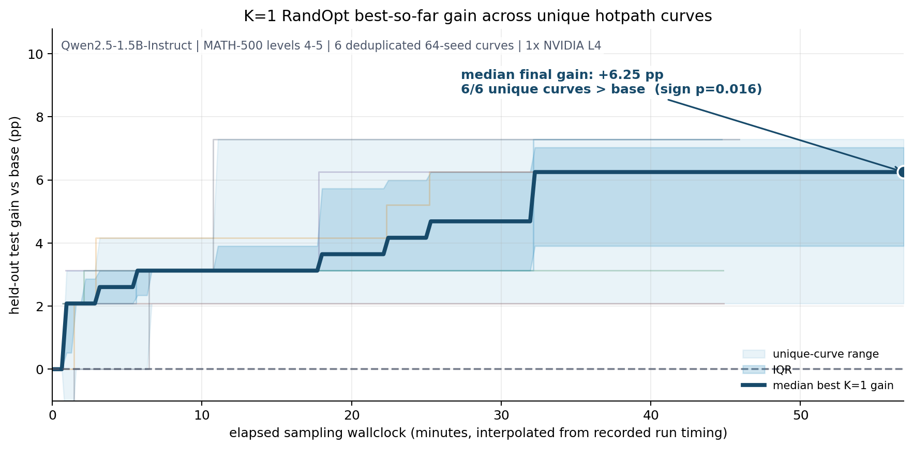
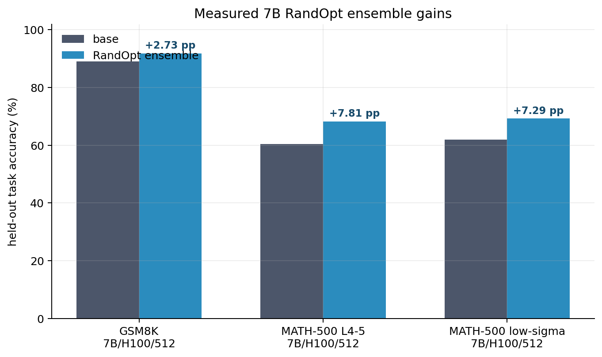
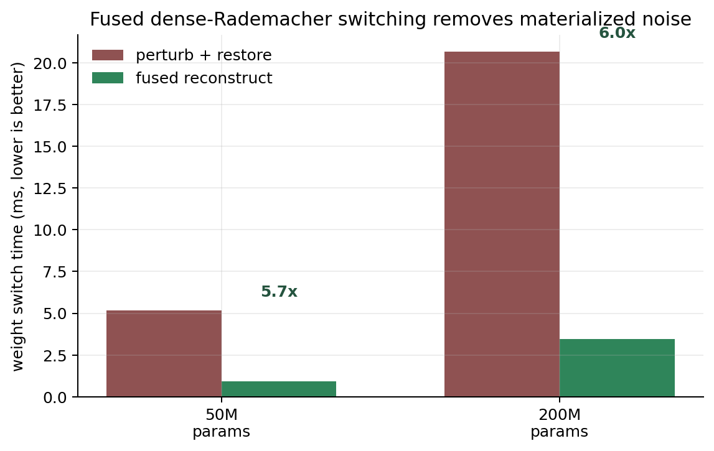
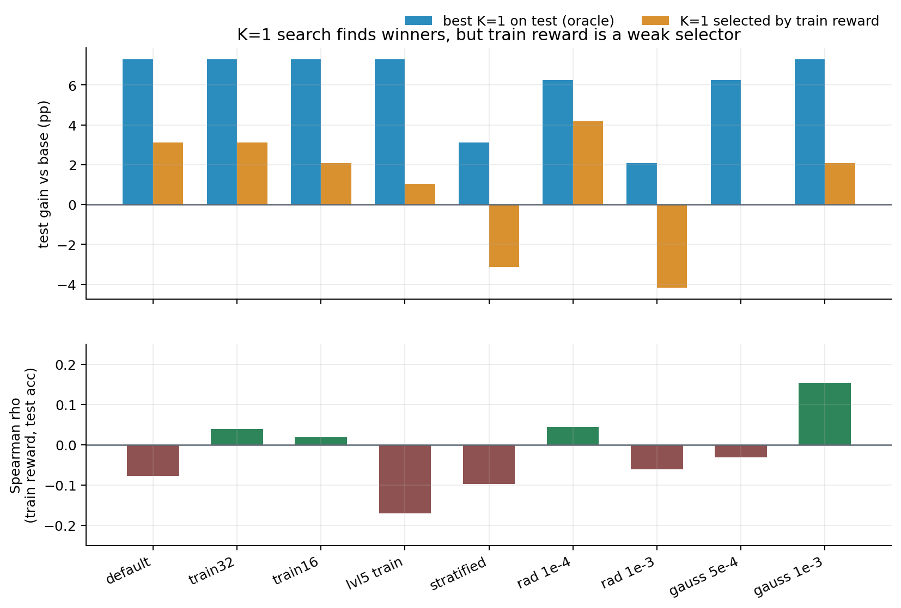
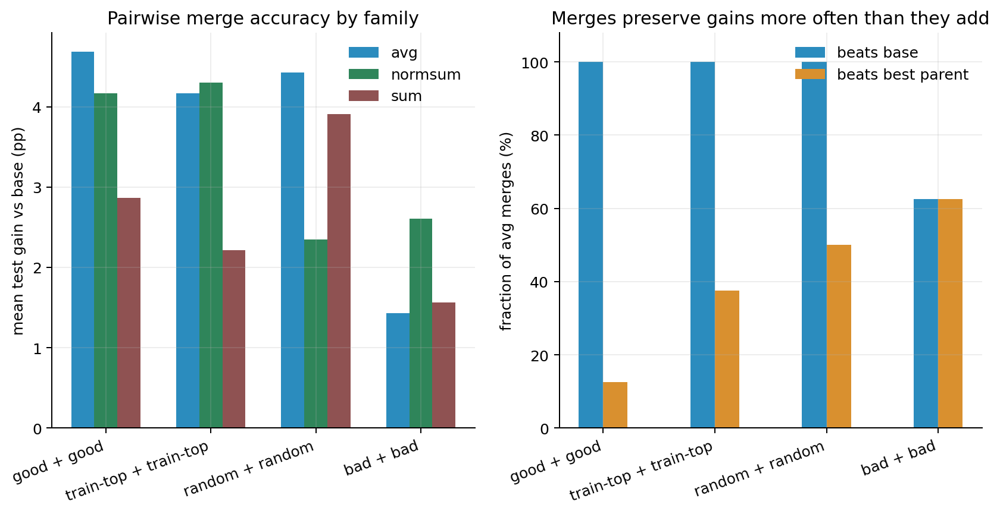

<div align="center">

# RandOpt Speedrun

**Gradient-free post-training with deterministic dense-Rademacher perturbations,
fast GPU weight switching, and reproducible held-out evaluation.**

[Original paper](https://arxiv.org/abs/2603.12228) |
[Project page](https://thickets.mit.edu) |
[Methodology](docs/SPEEDRUN.md) |
[Records](RECORDS.md) |
[Research log](docs/RESEARCH_LOG.md)


</div>

## Executive Summary

RandOpt evaluates many small random perturbations of a pretrained model, selects
perturbations by task reward, and ensembles the best candidates. This repository
turns that idea into a systems-oriented open-source research project: a fast
weight-switching runtime, benchmark records, diagnostic tooling, and saved
artifacts for follow-up analysis.

The central engineering contribution is a deterministic dense-Rademacher
switching path:

```text
W(seed, sigma) = W0 + sigma * R(seed, parameter_index)
```

The fused implementation reconstructs live weights directly from a resident base
copy. It avoids materialized full-model noise tensors, removes the restore pass,
and makes each perturbation path-independent and reproducible across switches.



Measured outcomes in this fork:

- **7B RandOpt ensembles improve held-out task accuracy** on 512-seed H100 runs:
  +2.73 percentage points on GSM8K and +7.81 percentage points on MATH-500
  levels 4-5.
- **Held-out FineWeb bits-per-byte improves slightly** on the same full 7B runs,
  even though FineWeb is never used for selection.
- **The fused switch kernel is 5.7x-6.0x faster** than the materialized
  perturb-plus-restore baseline in measured L4 kernel validation.
- **The research harness exposes failure modes honestly**: K=1 random search
  finds strong individual perturbations, but train reward is usually a weak
  selector; pairwise seed merges often beat base, but "good + good" is not yet
  clearly better than random pairing in the saved 48-seed sample.

## Results

### 7B Ensemble Runs

The headline runs use Qwen2.5-7B-Instruct on a single H100 with CUDA graphs,
512 candidate seeds, greedy decoding, and disjoint train/test slices. Full
records are in [`speedrun-runs/`](speedrun-runs/) and summarized in
[`RECORDS.md`](RECORDS.md).



| run | hardware | population | base | ensemble | gain | FineWeb bpb, base -> ensemble | throughput |
|-----|----------|-----------:|-----:|---------:|-----:|------------------------------:|-----------:|
| GSM8K | 1x H100 | 512 | 89.06% | 91.80% | +2.73 pp | 0.59316 -> 0.59182 | 0.275 seeds/s |
| MATH-500 levels 4-5 | 1x H100 | 512 | 60.42% | 68.23% | +7.81 pp | 0.59312 -> 0.59199 | 0.0777 seeds/s |
| MATH-500 low-sigma | 1x H100 | 512 | 61.98% | 69.27% | +7.29 pp | 0.59313 -> 0.59258 | 0.0765 seeds/s |

The larger MATH-500 gain is the important task-difficulty result: when the base
model has meaningful headroom, the ensemble lift is much larger than on a
near-saturated GSM8K slice.

### Weight-Switching Kernel

The runtime replaces per-seed materialized noise generation and restore with a
single fused reconstruction pass. GPU validation checks the Triton path against
the pure-torch reference bit-for-bit across fp32, bf16, and fp16.



| validation | result |
|------------|--------|
| `tests/test_kernel_gpu.py` on NVIDIA L4 | 7 passed |
| 50M elements | 5.17 ms -> 0.91 ms, 5.7x faster |
| 200M elements | 20.66 ms -> 3.46 ms, 6.0x faster |

### K=1 Diagnostic: Search Works, Selection Is Weak

The `hotpath.py` harness evaluates each seed independently on a train slice and
a held-out test slice. This separates the existence of useful perturbations from
the ability to find them using train reward.



Across the 1.5B MATH-500 sweep, oracle single-seed winners often exist
(frequently +6 to +7 pp over base), but Spearman correlation between train reward
and held-out test accuracy is usually near zero or negative. This is why the
project treats ensemble voting and held-out diagnostics as first-class concerns
instead of reporting train-selected single-seed wins alone.

### Pairwise Merge Diagnostic

The 7B merge study reuses the first 48 saved seed rows from a stopped population
run and evaluates 96 pairwise reconstructions across four pair families and
three linear merge operators.



Pairwise merges often preserve enough signal to beat base, but the saved sample
does not support the stronger claim that merging two good seeds reliably adds
their effects. In the `avg` operator, test-good + test-good and random + random
both beat base in every sampled pair, with nearly identical mean accuracies.
Details and caveats are in [`docs/RESEARCH_LOG.md`](docs/RESEARCH_LOG.md).

## What Is In This Repository

| area | files | purpose |
|------|-------|---------|
| Perturbation runtime | [`core/perturb.py`](core/perturb.py), [`utils/worker_extn.py`](utils/worker_extn.py) | deterministic Rademacher reconstruction, fused two-seed linear combine, worker integration |
| Speedrun harness | [`speedrun.py`](speedrun.py), [`configs/`](configs/) | reproducible RandOpt runs with throughput, ensemble accuracy, and FineWeb bpb |
| K=1 research loop | [`hotpath.py`](hotpath.py), [`scripts/plot_hotpath.py`](scripts/plot_hotpath.py) | train/test transfer diagnostics for individual perturbations |
| Merge analysis | [`merge_run.py`](merge_run.py), [`merge_from_rows.py`](merge_from_rows.py), [`merge-runs/`](merge-runs/) | pairwise seed-composition experiments from saved rows |
| Results and figures | [`RECORDS.md`](RECORDS.md), [`docs/RESEARCH_LOG.md`](docs/RESEARCH_LOG.md), [`docs/assets/`](docs/assets/) | measured runs, interpretation, and README plots |
| Tests | [`tests/`](tests/) | CPU math tests, worker tests, FineWeb tests, GPU kernel validation |

## Installation

```bash
python -m venv .venv
source .venv/bin/activate
pip install -r requirements.txt
```

For GPU speedrun work, use a CUDA host with vLLM-compatible PyTorch. Triton is
only required on Linux/CUDA; off-GPU environments fall back to the pure-torch
reference path.

## Reproduce The Local Checks

```bash
# CPU checks
python -m pytest tests/test_perturb.py tests/test_worker.py \
  tests/test_fineweb.py tests/test_speedrun.py -q

# GPU kernel validation
python -m pytest tests/test_kernel_gpu.py -q -s

# Regenerate README figures from checked-in artifacts
python scripts/plot_readme_figures.py
```

## Run RandOpt

Small local or single-GPU runs:

```bash
python speedrun.py --config configs/smoke_1gpu_small.yaml
python hotpath.py --config configs/hotpath_1b.yaml
```

Full benchmark-style runs:

```bash
python speedrun.py --config configs/run_512_7b_h100.yaml
python speedrun.py --config configs/run_512_7b_math500hard.yaml
python speedrun.py --config configs/standard_8xh100_qwen72b.yaml
```

Custom datasets are supported through the data-handler interface described in
[`CUSTOM_DATASET_GUIDE.md`](CUSTOM_DATASET_GUIDE.md). Standard dataset setup is
documented in [`data/README.md`](data/README.md).

## Research Position

This project is intentionally evidence-driven. It does not claim that random
perturbation search is a universal substitute for gradient training. It shows
that, with a fast and reproducible runtime, RandOpt-style post-training can be
measured cleanly at useful scales, and that the resulting artifacts are rich
enough to study both positive results and failure modes.

Near-term open problems:

- improve train-to-test selection so K=1 winners can be found without oracle
  access to held-out data;
- scale data-parallel seed evaluation across multiple engines and nodes;
- compare dense-Rademacher search against Gaussian, low-rank, LoRA, and
  activation-subspace perturbation families under the same held-out protocol;
- extend merge diagnostics beyond two-seed linear operators and small samples;
- add a public CI path for CPU tests and an optional GPU validation workflow.

## Provenance And Citation

This repository builds on the RandOpt / Neural Thickets work by Yulu Gan and
Phillip Isola. Please cite the original paper when using the method:

```bibtex
@misc{gan2026neuralthickets,
  title={Neural Thickets: Diverse Task Experts Are Dense Around Pretrained Weights},
  author={Yulu Gan and Phillip Isola},
  year={2026},
  eprint={2603.12228},
  archivePrefix={arXiv},
  primaryClass={cs.LG},
  url={https://arxiv.org/abs/2603.12228}
}
```
