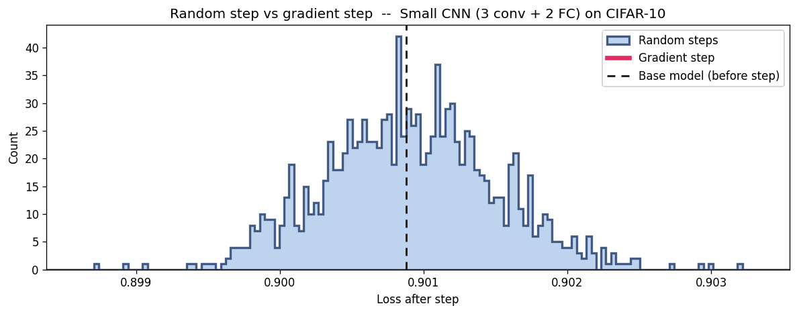
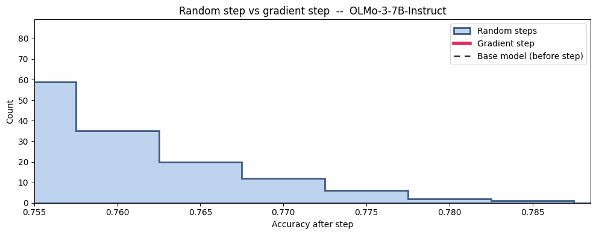
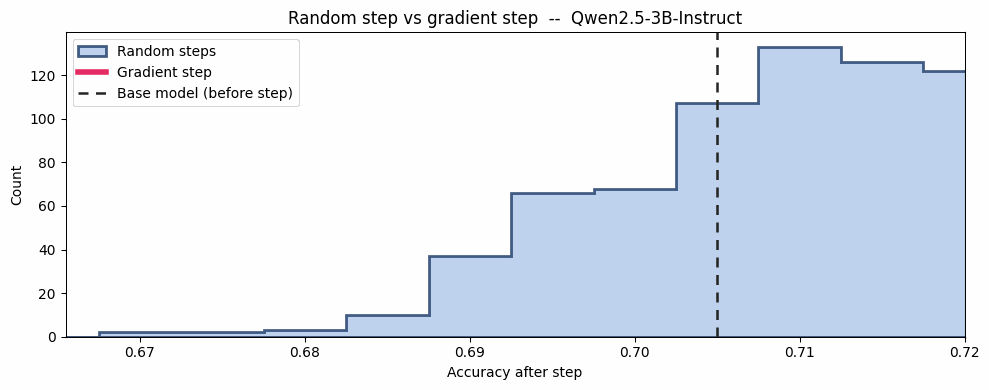

# One Gradient Step vs Random Steps

[](https://colab.research.google.com/drive/1eQuyHt0h-v5lwoyFhsxRco-U1FPdPOMz?usp=sharing)









- The PPO one-step update has norm `||Δθ_PPO||_2 = 1.80` (Qwen2.5-3B-Instruct), `||Δθ_PPO||_2 = 1.94` (OLMo3-7B-Instruct).

- A Gaussian perturbation is sampled as `ε ~ N(0, σ^2 I)`, and its raw norm can be much larger (example: `||ε||_2 = 55.6` for Qwen 3B, `||ε||_2 = 85.6` for OLMo 7B).


## What do the figures mean?

- **First figure (reproduced from [a 2022 post](https://x.com/stanislavfort/status/1529865444701577216)):** For a small CNN on CIFAR-10, we measure the loss change from random steps matched in length to a gradient step at the same weights. The gradient step is approximately a 185-sigma event, essentially impossible to obtain from random directions.

- **Second figure**: The story changes with good pretrained models: for OLMo-7B, there is about a 50% chance that one random step outperforms one gradient step, while for Qwen-3B the probability is around 16%. (Note: The noise is rescaled to match the L2 norm of a single PPO gradient update)


## Usage (Local)

```bash
python compare_ppo_randopt.py \
  --base_model allenai/Olmo-3-7B-Instruct \
  --ppo_ckpt <your_ppo_step1_ckpt> \
  --data_path <your_eval_parquet> \
  --out_dir outputs/compare_grpo_randopt
```
